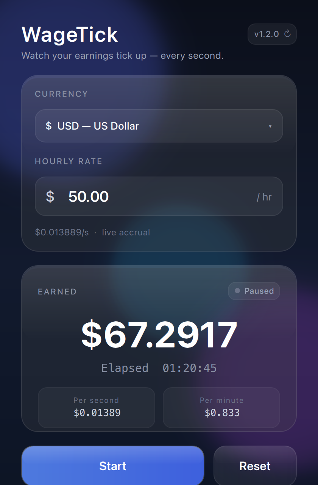

# WageTick

[](LICENSE)
[](#requirements)
[](https://www.qt.io/)

Watch your earnings tick up — **live, every second**.

Set your hourly rate in **USD ($)**, **EUR (€)**, or **GBP (£)**, hit **Start**, and the counter climbs in real time. Pause with **Stop**, clear with **Reset**.

Built with **C++17 + Qt 6 QML** · glassmorphic UI · **Apple Silicon** macOS

<p align="center">
  
</p>

<p align="center"><em>Example: <strong>1h 20m 45s</strong> at $50/hr → <code>$67.2917</code> earned · elapsed <code>01:20:45</code></em></p>

---

## Features

- Hourly rate with currency dropdown (USD / EUR / GBP)
- **Start from** a chosen elapsed time (`H:M:S`) — earnings begin at that position
- Start / Stop / Reset
- Live earnings (4 decimal places) from precise elapsed time
- Elapsed clock `HH:MM:SS`
- Per-second and per-minute rates
- Glassmorphic dark UI
- In-app update checks via [GitHub Releases](https://github.com/faizhameed/wagetick/releases)
- Rate and start time locked while the timer is running

---

## Install

**Requires:** Apple Silicon Mac (M1/M2/M3/M4…), macOS 12+ recommended.

```bash
git clone https://github.com/faizhameed/wagetick.git
cd wagetick
./install.sh
```

Then open from **Launchpad**, **Spotlight** (`⌘Space` → WageTick), or:

```bash
open -a WageTick
```

### What `install.sh` does

1. Verifies Apple Silicon (`arm64`)
2. Ensures Xcode Command Line Tools and [Homebrew](https://brew.sh) are available
3. Installs build deps: `cmake`, `qtbase`, `qtdeclarative`, `qtsvg`
4. Builds a Release `.app` and bundles Qt frameworks
5. Ad-hoc code-signs and installs to `/Applications/WageTick.app`

First install can take several minutes while Homebrew fetches Qt (~1–2 GB free disk recommended during build; app is ~120 MB).

### Update

```bash
cd wagetick
git pull
./install.sh
```

Or follow the in-app **Update available** banner when a new [release](https://github.com/faizhameed/wagetick/releases) is published.

### Uninstall

```bash
./uninstall.sh
# or
rm -rf /Applications/WageTick.app
```

---

## Requirements

| | |
|---|---|
| **Mac** | Apple Silicon only (`arm64`) |
| **OS** | macOS 12 Monterey or newer (recommended) |
| **Network** | First install needs network for Homebrew/Qt |
| **Intel Macs** | Not supported by the installer |

---

## Usage

1. Choose a **currency** from the dropdown  
2. Enter your **hourly rate**  
3. Optionally set **Start from** (`hr` / `min` / `sec`) if you already worked some time  
   — e.g. `1 : 20 : 10` at `$55/hr` starts earnings at about `$73.49` and the clock at `01:20:10`  
4. Press **Start** — time and earnings continue from that position  
5. **Stop** pauses (time is kept); **Reset** clears the session back to zero  

While running, the hourly rate and start-from fields are locked so you don’t change them by accident mid-session.

### How earnings are calculated

```text
earned = (elapsed_milliseconds / 3_600_000) × hourly_rate
```

Elapsed time uses a high-resolution clock and accumulates across pause/resume.

---

## Updates (end users)

WageTick checks GitHub Releases about once a day (and when you click the version chip in the header).

If a newer **published** release exists:

| Action | What it does |
|--------|----------------|
| **View release** | Opens the GitHub release page |
| **How to update** | Opens install/update instructions |
| **Skip** | Hides that version until a newer one ships |
| **✕** | Reminds again in ~24 hours |

Updates are **not** installed silently — re-run `./install.sh` (or follow the release notes).

---

## Contributing

Contributions are welcome — bug reports, features, docs, and design polish.

**You do not need write access to the repo.** The usual open-source flow is:

1. **Fork** this repository  
2. Create a **branch** for your change  
3. Open a **Pull Request** into `main`  

Maintainers review PRs and merge. See **[CONTRIBUTING.md](CONTRIBUTING.md)** for setup, branch naming, PR guidelines, and how releases work.

- 🐛 Bugs → [Issues](https://github.com/faizhameed/wagetick/issues)  
- 💡 Ideas → Issues or a draft PR  
- 🔐 Security-sensitive reports → open a private advisory or contact the maintainers if available  

### Development build (no install to Applications)

```bash
brew install cmake qtbase qtdeclarative qtsvg
cmake -S . -B build -DCMAKE_BUILD_TYPE=Debug
cmake --build build -j
open build/WageTick.app
```

Full install from a local tree:

```bash
./install.sh
# or
make install
```

---

## Project layout

```text
wagetick/
├── install.sh / uninstall.sh   # end-user install to /Applications
├── CMakeLists.txt
├── CONTRIBUTING.md
├── src/                        # C++ engine (wage timer, update checker)
├── qml/                        # Qt Quick UI
├── resources/                  # App icon (.icns)
├── docs/                       # Screenshots & docs assets
└── scripts/                    # Maintainer helpers (icon, screenshot)
```

---

## License

This project is licensed under the [MIT License](LICENSE) — free to use, modify, and distribute.

---

## Acknowledgments

- [Qt](https://www.qt.io/) for the application framework  
- [Homebrew](https://brew.sh/) for macOS packaging of the toolchain  
